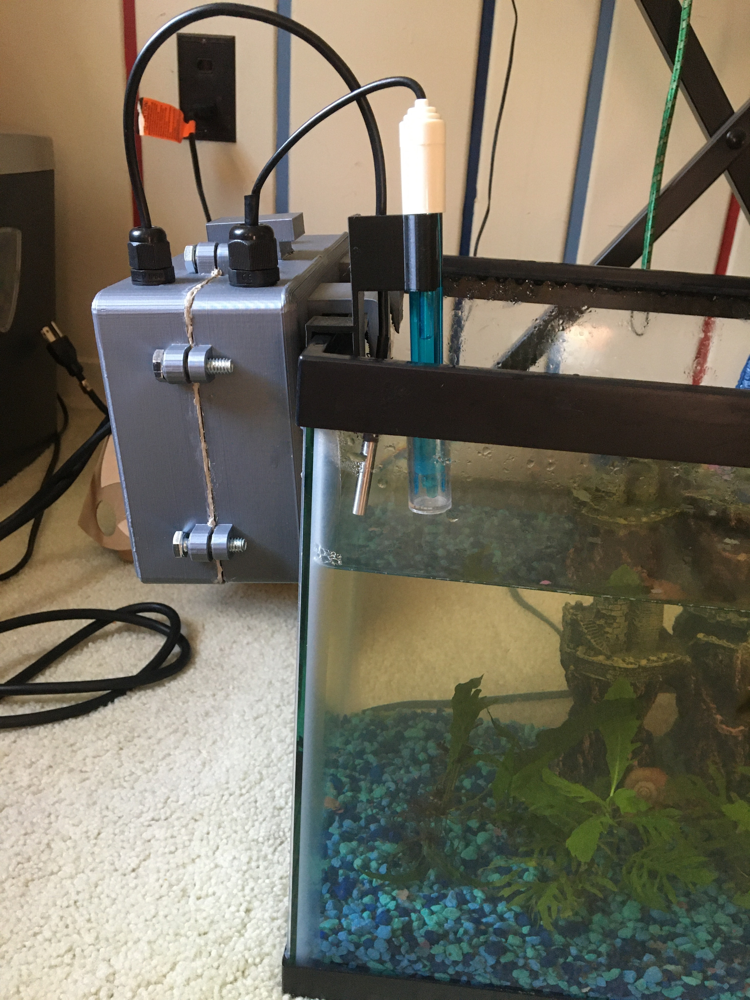
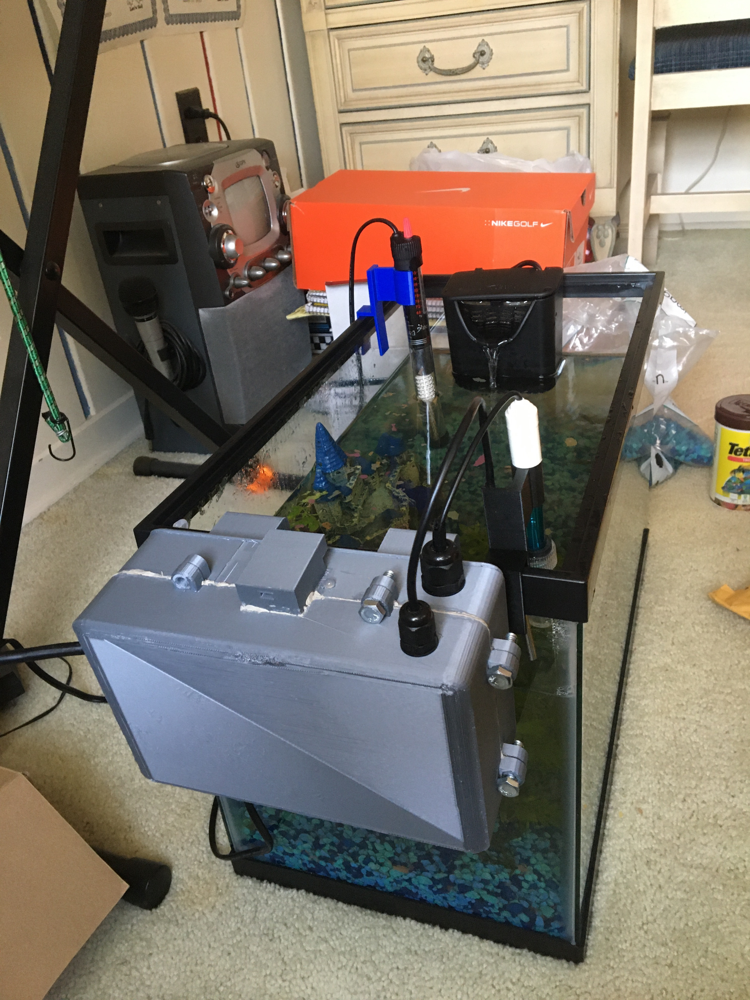
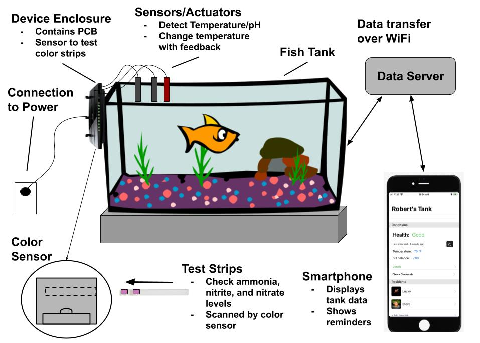
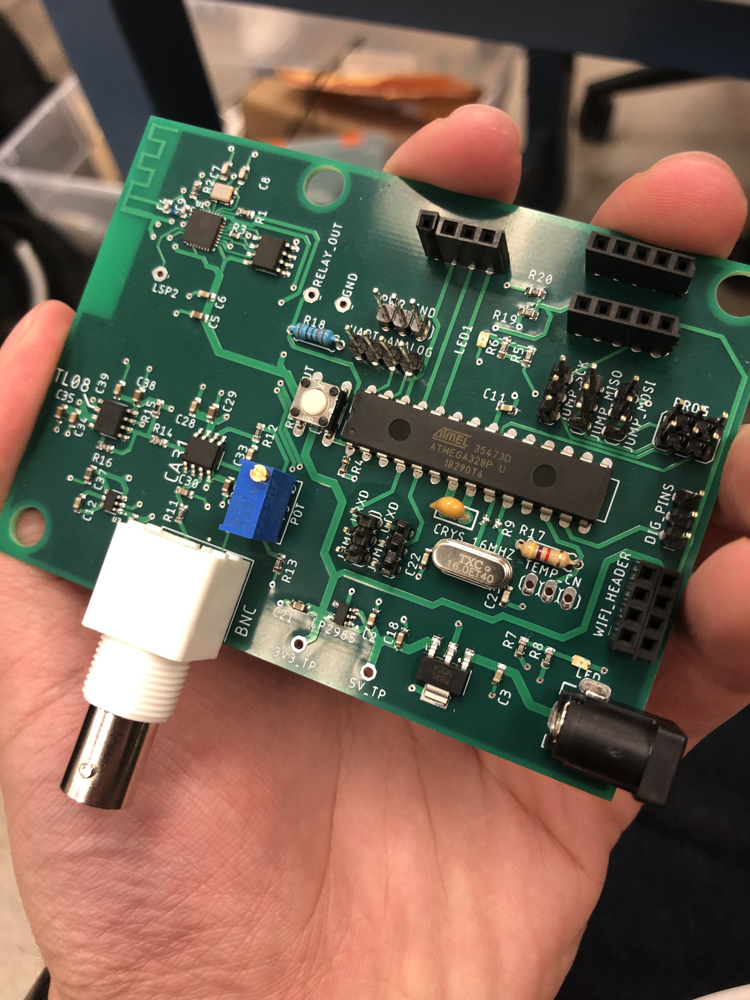
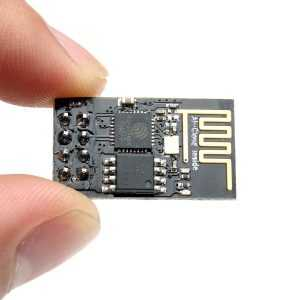
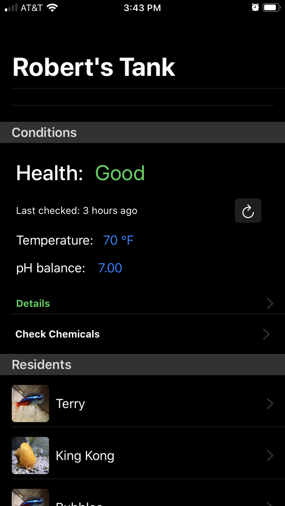
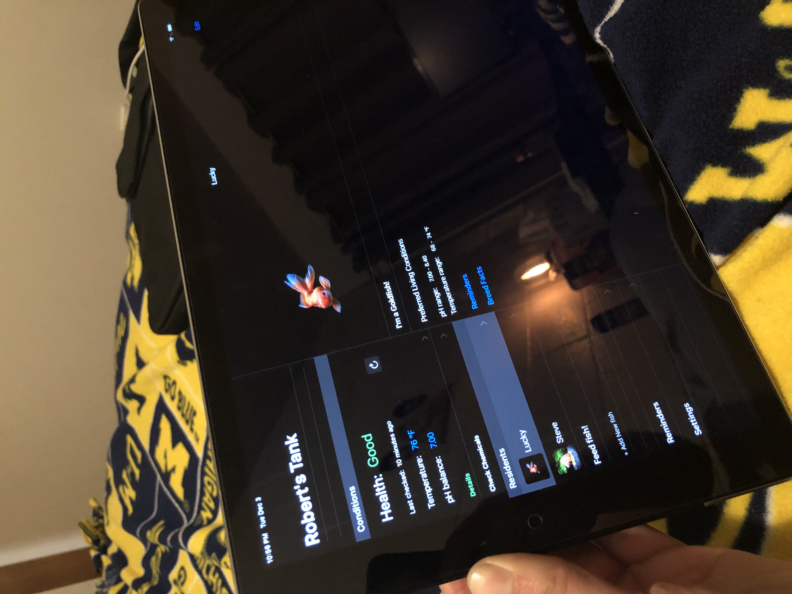

## Sofishticated: 
### A smarter fish tank for your finned friend

This was our final project for EECS 473, Advanced Embedded Systems at the University of Michigan.

## Overview:

The Sofishticated smart tank module is made a monitoring system that can connect to a fish tank and measure live data about its temperature and pH, while also controlling a water heater to keep it at optimal levels. The data is then streamed to an iPhone app, which lets a user see it and store fish profiles, schedule feeding reminders, and be guided in testing for Ammonia and Nitrate chemical buildup.
The end result is a smarter fish tank that lends to an easier fish keeping experience. 

The final project was demoed successfully at a design expo on December 5, 2019. It was deployed on a live marine environment, monitoring 6 fish and one sea snail.

## Technology:
The main component of the device is the enclosed Printed Circuit Board system, which runs a port of FreeRTOS for Arduino. The RTOS ran drivers for the pH sensor and Temperature sensor written in C and C++.

The PCB was connected to an ESP8266, which transmits the collected data over Wi-fi to a Flask Server, which relayed it to an iOS App.

The iOS App was written from the ground up, using the new SwiftUI framework.
Special thanks to https://github.com/AppPear/ChartView, which was used as a dependency for the app.

## Installation:
Be advised that this software was designed for a custom PCB designed and constructed from scratch, but can be adapted to any Arduino or Atmel system with a bit of modification.

## The sauce
All the C/C++ code that we run on the board is in LilFishTanks/LilFishTanks/lil_fish_tanks_arduino/.

All the Phone App code is in FishTank_app/FishTank/FishTank/.

## Authors
#### (left to right)

* **David Waier** 

* **Madeline Devore** 

* **Celine Schlueter**

* **Robert Cecil** 

* **Ray Puyat** 

## License
[MIT](https://choosealicense.com/licenses/mit/)